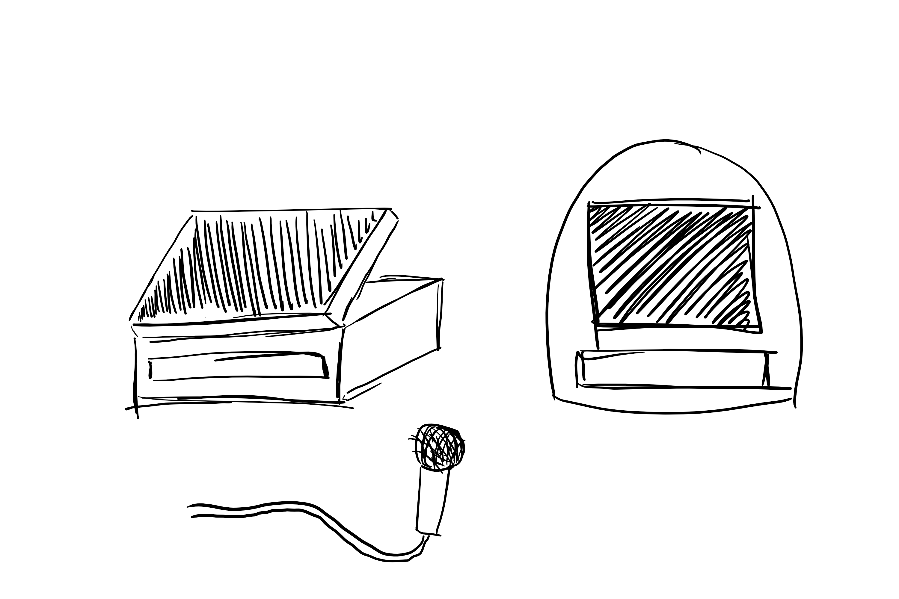
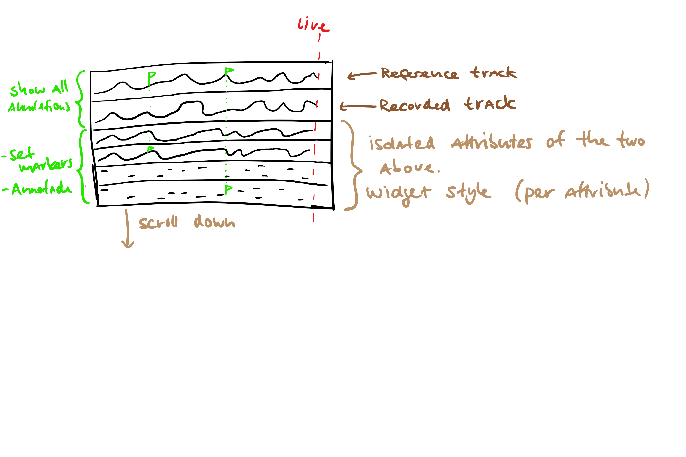
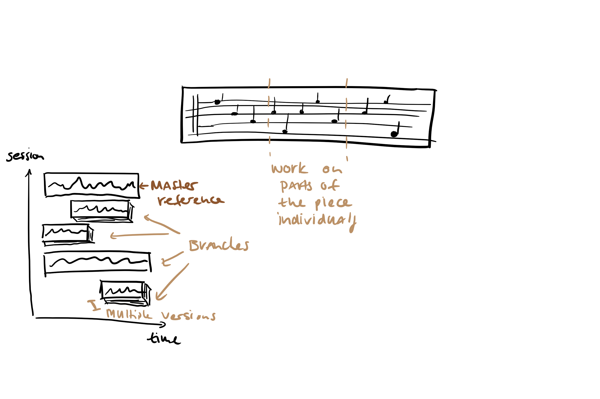
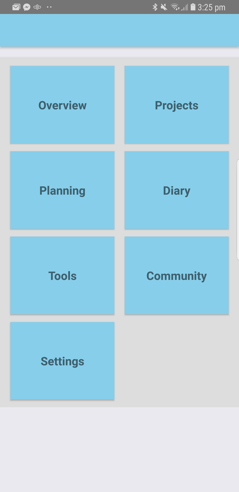
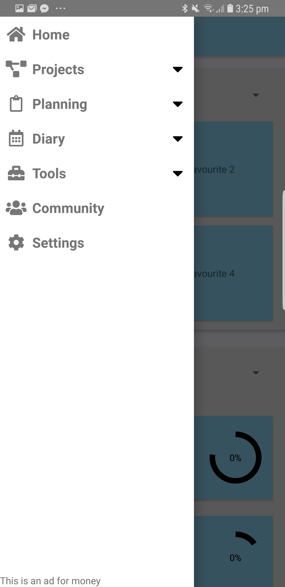
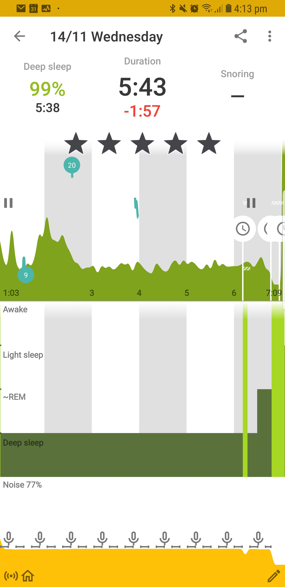

  

# Music planing App, Group 4

#### Fabian, Oliver, Guy and Pius

## W1: Project description

The goal of this project is to improve the effectiveness and focus during practise sessions when preparing for the performance of a musical pieces.
From our goal we understand the target audience to be musicians coming from a whole spectrum of expertise;
ranging from student to professional.
In summary we will try to provide a way to plan and keep track of one's journey towards perfecting each piece.

### Resources here:

The [content folder](./content/) and [Deliverables](./Deliverables/) has 'final versions' of the material we generated and should be referred to first.
The material created is stored in a [google drive folder](https://drive.google.com/folderview?id=1PBzoqfXrZz1RT7WT0kP88RAMHMnA3gEM) and the [content folder](content/).

## W2: Stakeholder

The project is made in collaboration with [Ivan Basic (ZHdK)](https://www.zhdk.ch/person/211783).
We met with him in the second week to talk about his ideas and the project to get a better understanding of the project.
Before meeting we had each individually formed some ideas and understanding of what the project might be about.
This was beneficial as we could present some ideas to Ivan that were not all necessarily relevant to the core ideas of the project but could be relevant in the future.
Meeting  with Ivan was essential for us to really understand what the project was about.
Ivan explained to us also how precious practice time is, as the practice rooms are in high demand, and users only have a limited amount of time.
We came to understand that playing music can deceptively appear -  even to the musician who is playing -  as practicing, but without focus a practice session can be inefficient, and actually waste the time of the musician.
Through our discussion with Ivan, we came to understand that, the core of the problem is that many musicians have the problem with a lack of discipline and often lose focus of the goals of the session when practicing.
The project's primary aim is to resolve this issue and provide a way to bring structure to the musician's practice sessions to ensure the musician's goals, both long-term, and immediate, are be met.
\
We asked Ivan to write down his 'practice process' to gain insight into the long term practice process.
Here are  [transcripts and recordings of the meeting](content/transcript%20stakeholder%20meeting.md) and [Ivan's practice formula](https://drive.google.com/open?id=1enS73yaeMvfAof8zEtGe3URoXVIFXiKN).

## W3: Need-finding and Personas

This week was about need-finding and getting an even better understanding of the project.
Through [affinity clustering](content/affinity%20clustering.md), each member of the group recapitulated the discussion with Ivan and wrote down their first observations.
This required each team member to think about the meeting and find words for their personal impressions.
The Observations on the cards got grouped together to form categories of our choice.
This process, and the process of sharing our individual thoughts on cards, lead us to better insights on the situation and the project as a whole.
See the images below for the results - click on the images to enlargen.

### W4: Personas

We also invented three differing personas which can serve us as guidance.
We created them such that they serve us as target audience.
By describing their situation and therefore their needs, we now have good reference when making decisions.

#### The personas in summary

(Click on the links for a more complete description)

[Jason](content/persona%20jesse.pdf), 27, a typical music student looking for an efficient way to study.

[Alana](content/persona%20alana.pdf), 19, an ambitious high school student working towards a music competition while trying to have as much free time as possible.

[Jennifer](content/persona%20jennifer.pdf), 34, a music teacher looking for a way to help her students even when she's not around.

## Ideation

With the help of our personas and an understanding of our goal we could now explore the whole designspace we are in.
The idea is to [brainstorm](content/brainstorm.md): thinking in any direction without caring about implementability or any other real world problems.
Since there exist no bad ideas in this context, we had both serious ideas and quite a bit of banter that lead us into interesting areas.

From this we narrowed down and fleshed out three main prototypes.
Since we already had a lot of ideas through the brainstorm and the work done in the weeks before, this task was relatively easy.
The hardest part was dumping *glorious thoughts* which turned out to be *not* so promising after all.
Still, we tried to create three totally different prototypes.
Each one tried to solve the problem in it's own way so as not miss any perspective, each combining more combinations of ideas we from the brainstorming process.
The results we [presented](Deliverables/prototypes presentation.pdf) the week after in class to get  [first feedback](content/feedback_presentation.md).
*(Actually this presentation is an extended version of the one given in class which was condensed to just the good stuff, we used this extended version in conjunction with other work when meeting with our stakeholder).*
After minor changes the ideas of our prototypes were presented our stakeholder Ivan.

### W6: Prototypes

As mentioned before, we created three different prototypes which could possibly solve the goal.
When designing them we tried to keep in mind our personas, e.g. *'Alana would not like this ... this something Jason would like.'* and the requirements we had derived so far.
Additionally we decided to try to do three different prototypes that combined different ideas in different modalities.
Click on the headers for the full details of the prototypes.

#### [10-π](content/ten-pi_app_prototype.pdf)  

- ˈtɛmpiː

An app with inbuilt functionality to plan and keep track of ones progress.

#### [bothofen](content/bothofen_prototype.pdf) 

- ˈbeɪˌtoʊvən

A small gadget providing deeper insight into the music played and a way to connect with peers or teachers.

#### [π-ano](content/pi-ano_prototype.pdf) 

- piˈænəʊ

A smart piano including pretty much everything the two above prototypes above provide.

#### Paper Prototypes

After a short discussion with our stakeholder, Ivan, it was clear to everyone that the app serves our goal and users best and that we'd focus on this prototype.
It made sense to us due to its easy deployment and because almost everyone in the audience our stakeholder wanted to target has experience with apps.
Furthermore, most people carry their phone with them already most of the time and has the capabilities that we might require.
The other prototypes helped us gaining insight into how the goals could also be achieved if portability was not a criteria.
Even though a physical device could potentially provide much more than an app, we decided it introduced needless complexity for the task, and for the functionalities we believed would be useful would still require an app like interface.

We created multiple paper prototypes of the app to get a feel for how different incarnations might appear and how different widgets and interactions could be facilitated.
See the prototypes below:
[PP1](content/paper_prototype_1.pdf),
[PP2](content/paper_prototype_2.pdf),
[PP3](content/paper_prototype_3.pdf),
[PP4](content/paper_prototype_4.pdf).

Each team member drew their own paper prototype.
This way each team member created their own first app paper prototype uninfluenced and could take their interpretation of the ideas we had developed together and mix them with any additional ideas of their own.
This was very useful to determine where we had still had different interpretations which we needed to discuss more, and also meant a larger pool of ideas area available to use later on.

We created a [rough outline](content/prototyping_outline.md) so we could combine the ideas we thought best more easily with each other.
The resulting discussion within the team showed we did have different points of view on either certain ways to best show things.
This being said, with our knowledge of guiding design principles (e.g. Neilson's ), reducing user surprise and maximizing familiarity narrowed the design space of how to implement our ideas significantly.
We sat down multiple times in the team, talking to potential future users in between, to get a feel what we (and they) needed.
At this stage the prototypes where still low-fi, which made re-evaluations pretty easy, however at some times it could be hard for users to come to the same understanding of how some of the functionalities might work, e.g. a pulsating screen as a metronome.
We started to code our own app, as the picture of the end software became more clear.
The priorities for development first were to test very limited navigation options.
Furthermore, we started to use reference of functionalities of already existing apps that had features we liked.
\
See below:

After composing a vision of the project as a whole and producing a coarse prototype getting feedback from potential users is needed.

### W8: User Study

The exercise was to design and conduct a user study/heuristic evaluation with our prototype.
To get this feedback a user study is required to confirm and refute our assumptions.
We focussed on producing low fidelity prototypes so that we could test different ideas we had and get feedback from potential users.
With this we should assess the usability of our design.

#### Study

We designed a study, carried it out and presented some of our intermediate results, then evaluated the data.
The [Study Evaluation](Deliverables/Study evaluation.pdf) shows the result of the study, statistics we extracted out of the data commented on it by us.

The [Detailed Study Report](Deliverables/detailed_study_report.pdf) contains our hypotheses, the methods we used to checked those and a short summary.

#### Presentation

We [presented](Deliverables/study_presentation.pdf) the study to the class and to our stakeholder - Ivan - along with the reports.
The study provided us with useful insight as to what we needed to prioritise and some concrete things to change; for example some of the buttons in our test prototype had misleading and confusing names for the task they were intended.
The feedback provided by the user study showed us where the project stands as a whole and gave us a way forward with the project.

#### Evaluation and Data

##### Evaluation
We attained the data by conducting the tests described in the detailed study report and noted down the result in an [Evaluation Form](https://docs.google.com/forms/d/1mMPWOriXPx2D7pERDGj-8rZW28IvjL5L10zMLD73cyg/viewform?edit_requested=true) (or [in pdf form](Deliverables/Evaluation Form - Google Forms.pdf)).

##### The data

The raw data can be seen [here](content/excel_raw_study_data.xlsx).

## Final design

We changed the objective of developing the app from being merely a device for use in the study for some very limited options to a medium-fidelity prototype.
At the same time we were also learning how to use the javascript framework so development was slow, and the app is prone to various bugs - we are sure with a little practice making a ‘med-fi’ prototype could be relatively quick.
The focus for the app was to create an outline for the various functionalities and affirm the practice work flow we had developed based on the process initially Ivan had described to us.
The practice work flow is a means of organising and planning music practice into tasks that constitute both a session, and a project.
A project is say a piece of music, or concert, or a musicians' lifelong skills, individual tasks might be to read the music, or play scales, or play through a piece.
These projects can be broken up into different stages - for dividing up say background research, playing, and refining a piece of music.
Additionally recordings and notes can be added/and deleted from projects and during the session - not all of these elements are yet implemented in the app.
A session is when a musician would sit down to actually perform these tasks, and these can be organised through a calendar interface.
The time spent on individual tasks and sessions is easily tracked by pressing a start, pause, or stop button and the time is then attributed to the task and session, and the corresponding(session) ( some of this is a little buggy still).
\
The app was designed with very large simple buttons to aid in navigation with a ‘Favourites’ section and an overview of projects and the next practice session.
There is definitely room for the prototypes development. There are several bugs, and missing functionality.
However from showing users the app the priority for future work would be making the app more user friendly.
For example, a 'quick start' key from a project to start a practice session was something that was implicitly asked for by some initial testers, and reordering some of the information that is displayed. The app is also too minimal at the moment and could be improved by adding some more indicative visual elements, and adding behaviour that expected by users familiar with similar interfaces.
All of these improvements the team are aware of, however the initial set-up of the backend code meant that getting these basic features had to wait for some other parts of the app to be developed.
Since we decided the focus when developing the app was affirming the process of the work flow, the navigation and visual design were not worked on extensively.
Navigation would definitely be the next focus, these changes would be non-controversial and would be implementing various navigation linkages and adding some hints/indicators so the app behaves more intuitively.

<!-- Linked is the app package (android only for now). -->

### Video

While developing the app we made a video to try to illuminate the problem we are trying to solve, and the solution we offer.
We tried to capture the reason for the app and the solution it provides.
Furthermore, it should tell a story that's somehow relatable for musicians.
In the beginning we sketched out real life scenes the video could include, showing such relatable situations.
We later came to the conclusion that every person knows this problem in his own way.
We therefore tried to formulate the problem in the Video in a way that everyone can relate to the problem in their own personal way.
Besides the problem we shortly introduced the app.- for the future showing more usage would be helpful.
Since the app was actively changing while we were making the video we left capturing the app's usage until the end, and unsurprisingly this was not a great idea and in the end we were unable to get a proper recording of the app being used. 
In the future getting this would be something we would prioritise - the feedback received affirmed this.
For the video we used a program called VideoScribe.
With this app one can narrate a story in a "scribble" kind of way, we paid for the 'pro version' however I'm not sure we would do so again - anything beyond the most basic scribbles were additional costs.

The final Video can be found at:
[Here](https://drive.google.com/open?id=1vYRiSGH3-PIHuf1GDOifW6OC8yPEbuct)  in high quality version.
A compressed low-res version is in [here](Deliverables/Video_low_res.mp4).

## Final meeting With Ivan

We met with Ivan some time after the presentation.
Due to the Christmas break and Ivan's busy schedule he had not been able to see the final video.
We presented the video, the app, and discussed various aspects, improvements, and showed where some of the 'obvious' additions we didn't have time for (additional navigation) should be made.
We discussed the intellectual property rights (see the [minutes](content/final_meeting.md)) and gave our thoughts on how developing the idea further could be best done with the materials we have produced.
